# Foodies Together:smiley:

An app for the foodies by a foodie, where you can explore food, chat with your friends, and save the recipes, of your favourite food item. I have made this app using Flutter.
>Flutter is Google's UI toolkit for building beautiful, natively compiled applications for mobile, web, desktop, and embedded devices from a single codebase.
# Documentation:
## Initalizing and Logging:
The app launches with a dummy <b><i>initalizing screen</b></i> which configures the app for the first time use. 
Then the user is taken to the <b><i>login screen</b></i> where he is required to enter his username and password, which will then drive the user to the onboarding screen.
  
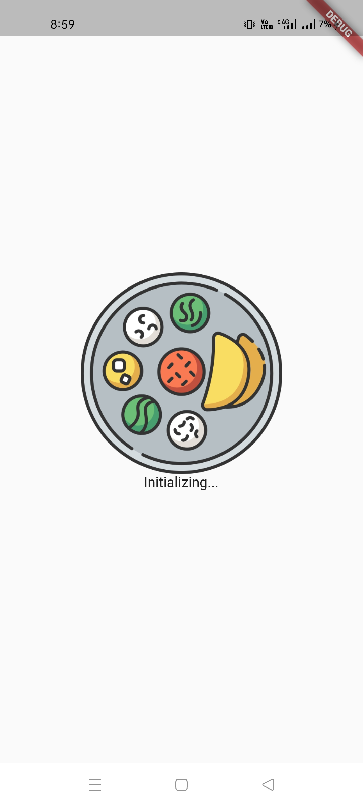
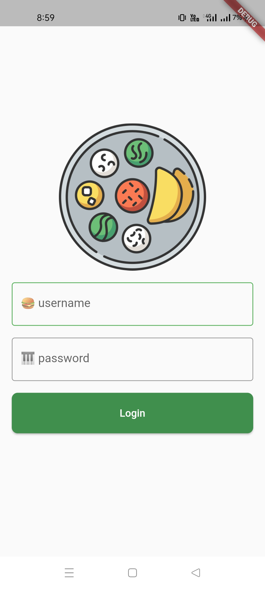
## Onboarding pages:
The <b><i>onboarding screen</b></i> is so created that the user find it easy to navigate through the app, and had a better user experience. The onboarding and initializing screen are shown only during the first run time of the app. User can either scroll through the three pages of the screen, or he can press on the skip, text button which will take him to the main screen.
  
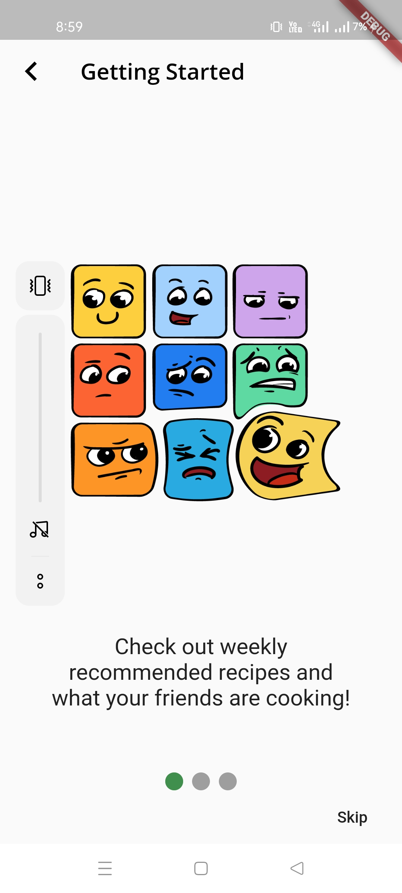
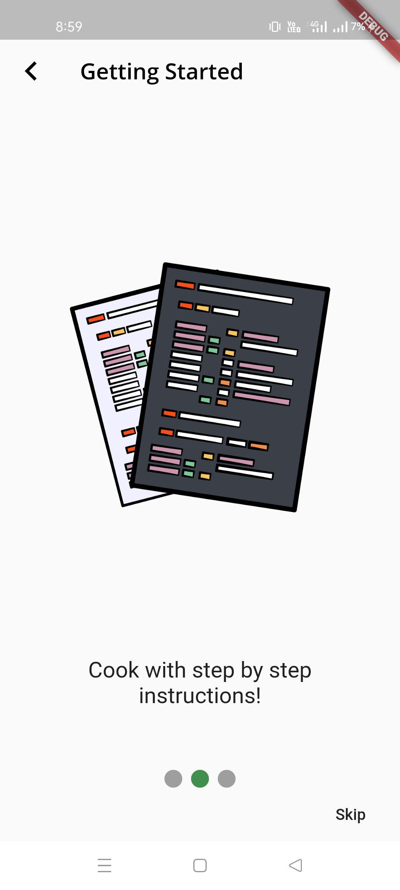
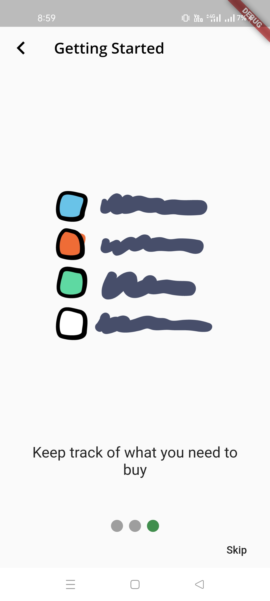

This is the core part of the app, and uses `BottomNavigationBar` property of the Scaffold. 
## Explore Page:
It uses two scrollable `ListViews`, the top one containing `HorizontalScrollView` and the bottom one of type `VerticalScrollView`.  The top scroll view detects gestures and 
shows different recipes of the day, and with Flutter's `chip`, the user can search for the trending foods. The bottom List is an interactive listview, where people discuss what they haven been cooking in an engaging manner.
  
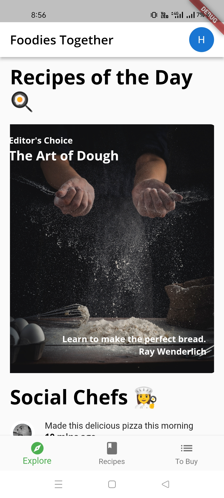
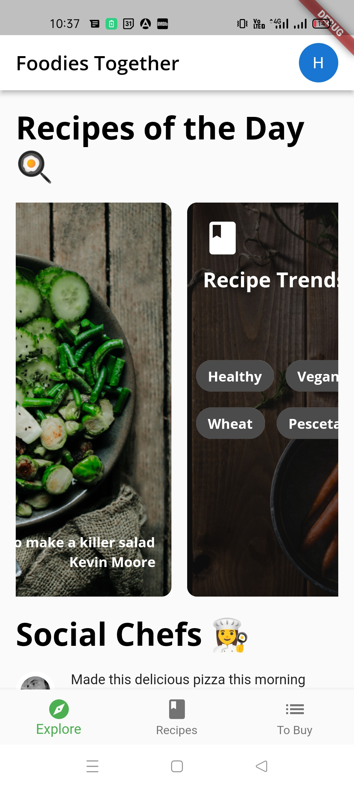
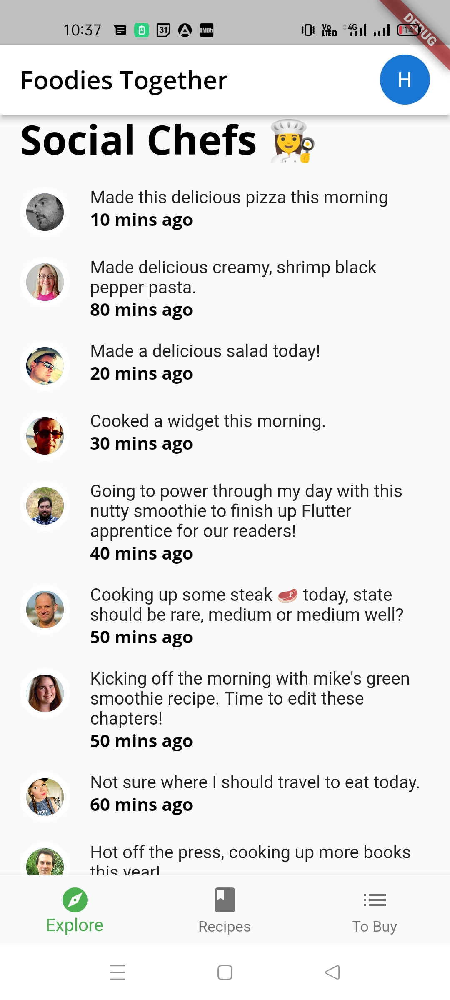
## Recipe Page:
It uses Flutter's powerful, `GridView` widget, to show different recipes from the dummy data model in an asthteic appeal.  
  
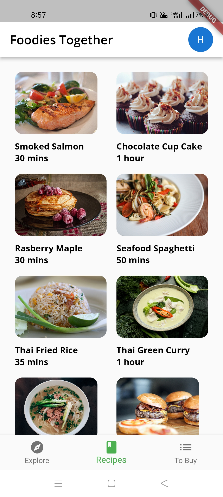
## To Buy Page:
If there are no items, selected by the user, then a vector is used to show the empty cart. On tapping `+` icon, the to add items page opens, where the user can input the details
of the recipes he is planning to buy. There are several fields, `TextController` controls the name of the item, `enums` are used in `chips` for their importance, and `Slider`
for quantity. Then the to buy page changes and it shows the selected items, where user can tap `Checkbox` to mark the recipe as used.
  
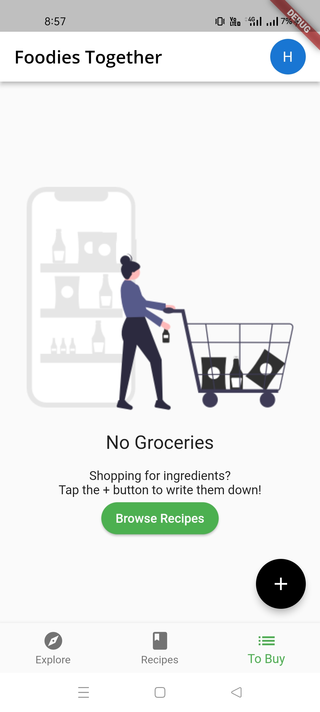
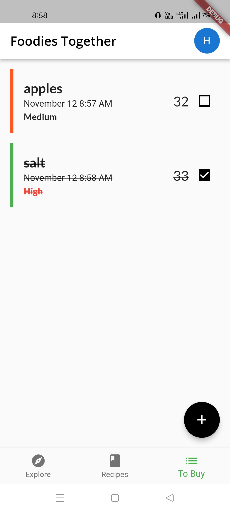
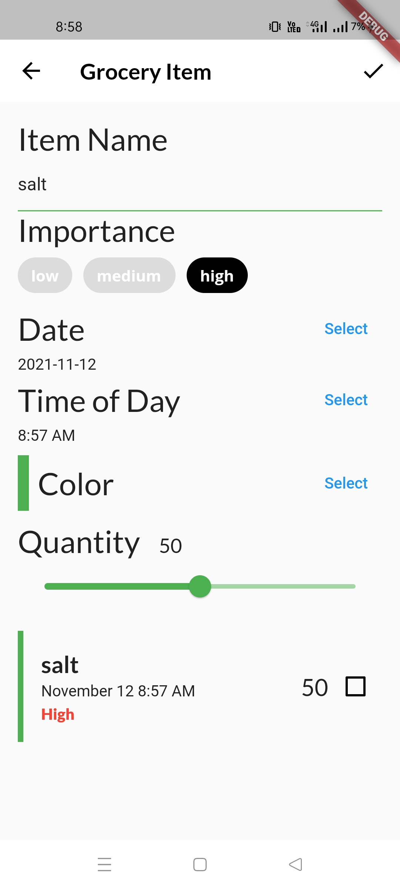
 
The three packages used for other aspects of to add grocery page are: 
`flutter_colorpicker: ^0.6.0` 
`intl: ^0.17.0`  
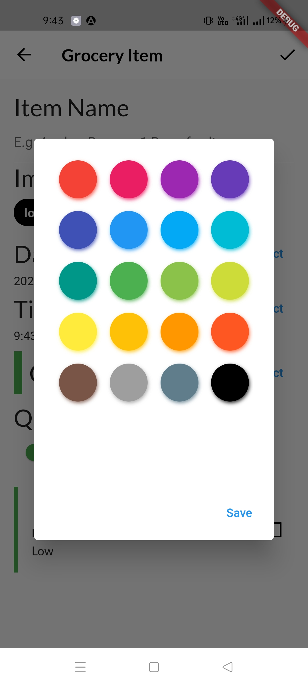
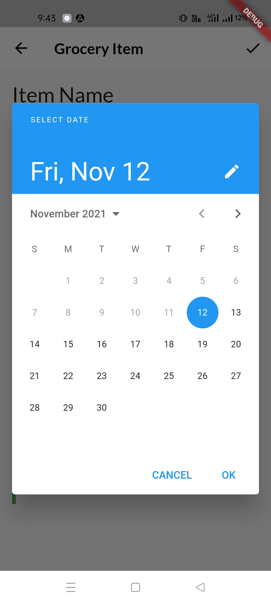
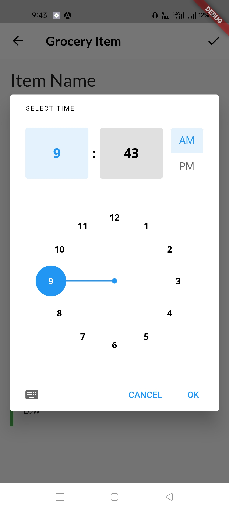
## Profile Page:
A simple profile page, that shows points collected by user, and a `CircleAvatar` for user's icon. It also has a log out functionality which will cause the app to 
initialize again. 
 
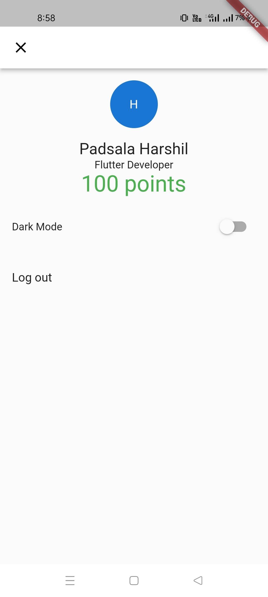
## Dark Theme:
On pressing the dark mode, button the UI refreshes to show dark mode, using inbuilt flutter `ThemeData` class.
 
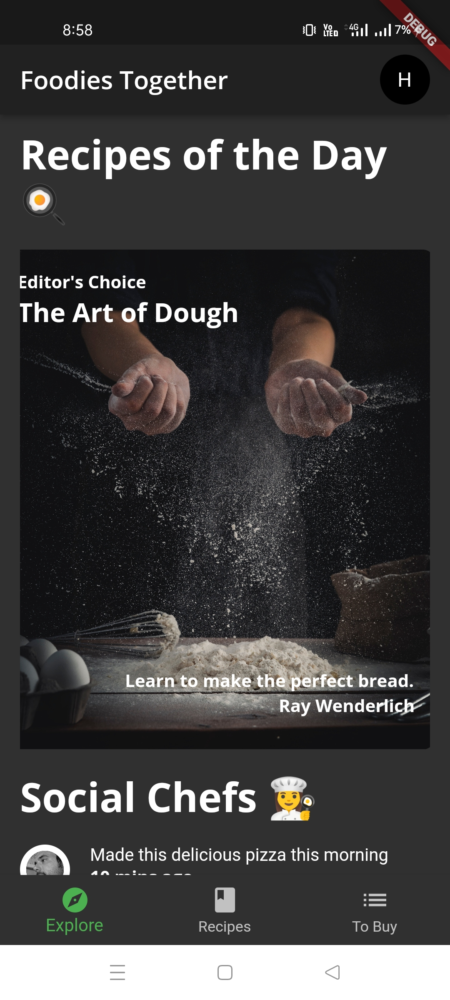
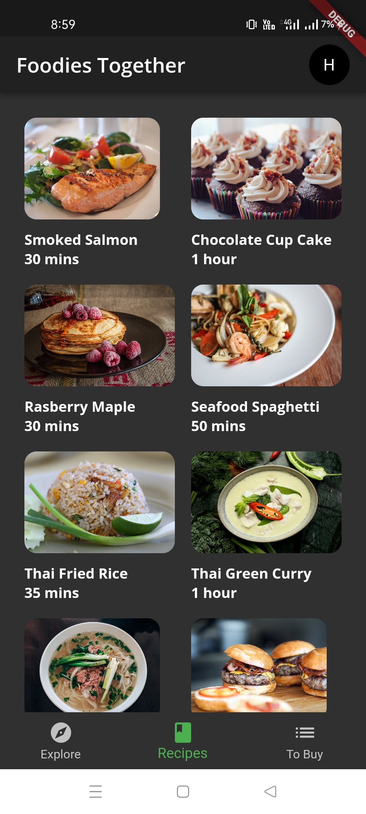
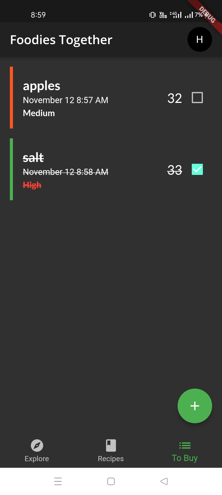 
## Other important packages
`smooth_page_indicator` - for making awesome animated page indicator 
`provider` - Google's recommended State Management 
`google_fonts` - For really amazing fonts 
`uuid` - For generating unique id's to assign Grocery items. 

